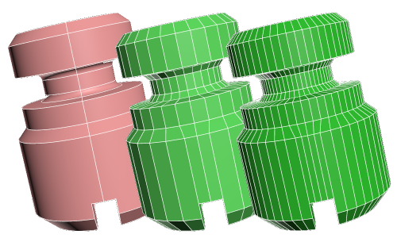

> Квадратне мешування CAD моделей в OBJ формат
- Повний цикл виробництва квадратної сітки від CAD до OBJ файла
- Дає можливість отримати з одної моделі різної густини сітку
- Максимально продуктивний для мешування CAD файлів в квадратну сітку
- Велика кількість інструментів
- Простий в користуванні

> **Виправлення -- Направлення -- Мешування**

[Дізнатися більше](getstarted)
